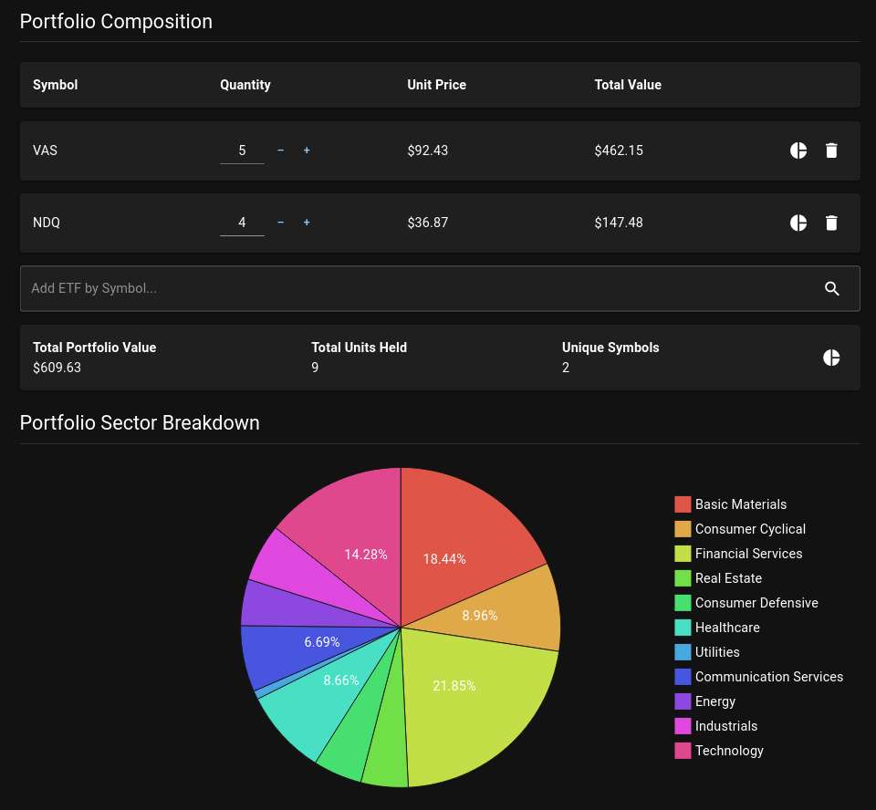

# AUS ETF Analyzer | [Demo](https://aus-etf-analyzer.ltrel.xyz)
AUS ETF Analyzer is a web application for analyzing the sector diversification in portfolios composed of ASX-listed ETFs.

## Screenshot


## Server Setup
### Method 1: Run a prebuilt Docker image
```
docker run -p 8000:80 ghcr.io/ltrel/aus-etf-analyzer
```
### Method 2: Build and run a Docker image from source
```
cd server
docker build . -t ltrel/aus-etf-analyzer
docker run -p 8000:80 ltrel/aus-etf-analyzer
```
### Method 3: Setup project manually
```
cd server
poetry install --no-root
poetry run uvicorn app.main:app
```

## Client Setup
Note that running the client in development mode requires an instance of the server available at the URL `http://localhost:8000`
```
cd client
npm install
npm run dev
```
